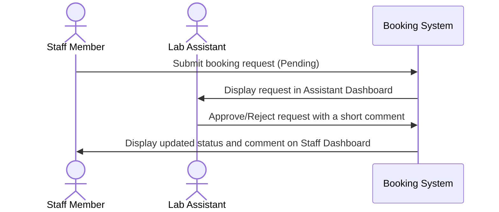

# Project Context: Equipment Booking System

## 1. Case Restatement
The Equipment Booking System is a web-based portal designed to streamline the reservation of shared lab equipment. Currently, staff members request bookings through manual messaging channels, which is inefficient and hard to track. The new system will allow:
- **Staff Members** to submit booking requests specifying the equipment, date, time, and purpose, and track their status.
- **Lab Assistants** to view all requests and either approve or reject them with feedback (a short comment).
- **Both Roles** to filter bookings to easily find relevant records.

---

## 2. Exact Workshop Scope
The application will be built as a full-stack web application consisting of:
- **Frontend**: A React application providing interactive user interfaces for both Staff and Lab Assistants.
- **Backend**: A Node.js and Express API server handling business logic, validation, and database queries.
- **Database**: A local MySQL database storing users, equipment list, and booking transactions.

---

## 3. Roles and Responsibilities

### Staff Member
- **Request Bookings**: Can select equipment, date, start time, end time, and specify a purpose to request a booking.
- **View Own Bookings**: Access a dedicated view showing only their submitted bookings and their statuses (Pending, Approved, Rejected) along with any assistant comments.
- **Restrictions**: Cannot approve/reject bookings (including their own) and cannot view or manage other users' bookings.

### Lab Assistant
- **Manage Booking Requests**: Access a dashboard listing all booking requests from all staff members.
- **Approve/Reject**: Can change the status of any request to "Approved" or "Rejected" and must provide a short text comment explaining the decision.
- **Filter and Search**: View, filter, and search bookings across the entire system.

---

## 4. Main Entity & Core Workflow

### Main Entity: Booking
The database will store the following attributes for each booking:
- `id`: Unique identifier (Primary Key)
- `equipment_name`: Name/ID of the requested equipment
- `requested_user`: Name/ID of the staff member requesting the booking
- `booking_date`: Date of the reservation
- `start_time`: Reservation start time
- `end_time`: Reservation end time
- `purpose`: Rationale provided by the staff member
- `status`: Current state of the request (`Pending`, `Approved`, `Rejected`)
- `assistant_comment`: Feedback left by the lab assistant upon approval/rejection

### Core Workflow

---

## 5. Secondary Features
- **Filtering**: Ability to filter bookings by:
  - Equipment name
  - Date
  - Status (`Pending`, `Approved`, `Rejected`)

---

## 6. Out of Scope
- **Real-time Notifications**: Email, SMS, or socket-based alerts when a booking is updated.
- **Advanced Calendar Integrations**: Syncing bookings with external calendars like Google Calendar or Outlook.
- **Equipment Inventory Management**: Add/Edit/Delete equipment profiles dynamically through the UI (equipment list will be pre-populated or simplified).
- **Production Auth/SSO**: Complex user registration and password reset workflows. A simple mock login or role-selection tool will be used for authentication.

---

## 7. Assumptions
- A preset list of equipment is sufficient for the initial implementation.
- A simple local user database table or role selector will be used to simulate authenticating as a "Staff Member" or "Lab Assistant".
- A staff member cannot approve bookings, and they are restricted from viewing other users' personal bookings.

---

## 8. Missing Details
- **Double Booking Policy**: Should the system automatically block overlapping booking requests for the same equipment, or is it up to the Lab Assistant to review and resolve overlaps?
- **Booking Modification**: Can a staff member cancel or edit a booking request after submitting it, particularly if it is still "Pending"?
- **Time Slots**: Are booking times continuous (arbitrary start/end times) or restricted to fixed hourly slots?

---

## 9. Likely Risks
- **Overlapping Bookings**: If multiple users request the same equipment at the same time, clear handling must prevent double-booking issues.
- **Role Enforcement Bypass**: Ensuring frontend restrictions are backed up by database/API-level role checks so that staff members cannot call approval endpoints.
- **MySQL Connection configuration**: Ensuring smooth database credential and schema initialization on the local environment.
