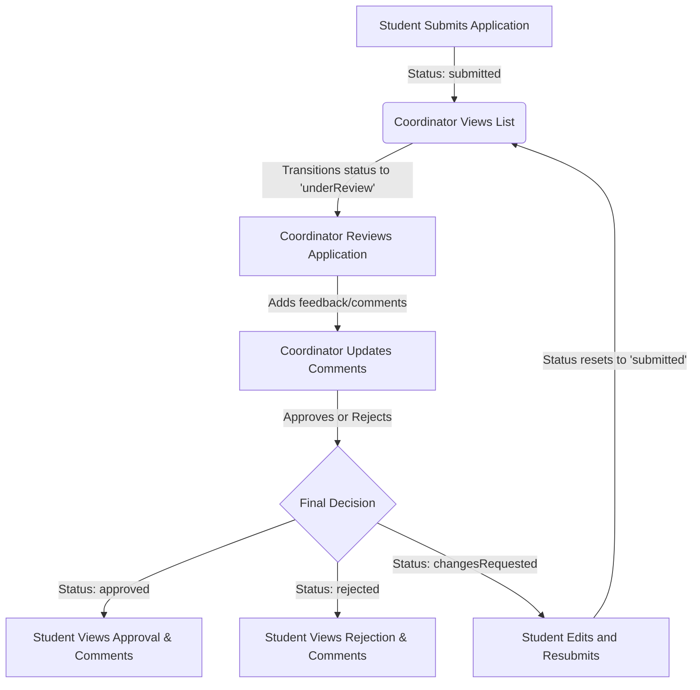

# Internship Application Tracker - Project Context

## 1. Case Restatement
The Internship Application Tracker is a web-based prototype designed to streamline the submission and review process of student internship placements. The system enables students to submit their internship details and track their status. Meanwhile, internship coordinators can review these applications, add feedback/comments, and transition the status of applications through their lifecycle. It enforces role-based permissions, ensuring students can only manage their own details and cannot self-approve applications or edit coordinator feedback.

## 2. Workshop Scope
The workshop scope is limited to building a functional, lightweight, local web application prototype using:
- **Frontend**: React (Single Page Application, using vanilla CSS for rich aesthetics, and simple local routing/state).
- **Backend**: Node.js with Express.
- **Database**: Local MySQL database for storing applications, roles, and comments.
- No production hosting, no third-party email systems, and no cloud-native service integrations are required.

---

## 3. User Roles & Responsibilities

### Student
- **Submit Applications**: Can submit a new internship application containing Student Name, Company Name, Position Title, Start Date, End Date, and Submitted Date.
- **View Status**: Can view their own submitted applications and their current status (`Submitted`, `Under Review`, `Approved`, `Rejected`, `Changes Requested`).
- **Edit & Resubmit**: Can edit and resubmit applications *only* when their status is `Changes Requested`.
- **Read Comments**: Can read coordinator comments on their applications.
- **Restrictions**: Cannot approve/reject applications or create/edit coordinator comments.

### Coordinator
- **View All Applications**: Can view a list of all submitted applications across all students.
- **Filter Applications**: Can filter the application list by Company Name and/or Application Status.
- **Review & Comment**: Can add or edit comments on any application.
- **Update Status**: Can update the status of applications (`Submitted`, `Under Review`, `Approved`, `Rejected`, `Changes Requested`).

---

## 4. Main Entity & Workflow

### Main Entity: `Internship Application`
- **Fields**:
  - `id` (INT, Primary Key, Auto-increment)
  - `student_name` (VARCHAR, Not Null)
  - `company_name` (VARCHAR, Not Null)
  - `position_title` (VARCHAR, Not Null)
  - `start_date` (DATE, Not Null)
  - `end_date` (DATE, Not Null)
  - `submitted_date` (TIMESTAMP, Default CURRENT_TIMESTAMP)
  - `status` (ENUM: `'submitted'`, `'underReview'`, `'approved'`, `'rejected'`, `'changesRequested'`, Default `'submitted'`)
  - `coordinator_comments` (TEXT, Nullable)

### Main Workflow

---

## 5. Secondary Features
- **Filtering & Searching**: Ability to filter the applications list on the Coordinator dashboard by:
  - Company Name (partial string match / search)
  - Application Status (dropdown selection)

---

## 6. Out of Scope
- File/Document uploads (e.g., resumes, internship offer letters, agreement forms).
- External accounts for company supervisors.
- Third-party authentication integrations (e.g., OAuth, SSO, SAML).
- Email, SMS, or in-app notification dispatch systems.
- Advanced reporting dashboards or analytics.

---

## 7. Assumptions
- **Role Switching/Auth**: For the purpose of this local prototype, a simple header-based role selector (switching between "Student" and "Coordinator") or a mock login screen will be used to simulate different users.
- **Database Connection**: The MySQL database will run locally (e.g., localhost) on standard port 3306, using basic environment variable configurations.
- **Data Retention**: Data is persistent in the local MySQL database; no automatic purging is required.

---

## 8. Missing Details
- **Multiple Applications**: Can a student submit multiple internship applications (e.g., if one gets rejected, can they submit another)? We assume yes.
- **Student Identity**: How are students distinguished from one another if authentication is mock? We assume we can mock a student ID or select from a list of predefined mock students.
- **Comments History**: Do we store a single comments field that gets overwritten, or a history of comments with timestamps? We assume a single, editable comments text field for the coordinator is sufficient.

---

## 9. Risk Notes
- **Security Bypass**: Because this is a prototype, there is a risk of client-side role enforcement being bypassed. The backend Express API must validate that only coordinator users can update status and comments.
- **MySQL Configuration**: Different local development environments might have different MySQL configurations (credentials, password policies). Clear schema initialization scripts must be provided.
- **Date Validations**: Ensuring `start_date` is before `end_date` and handling different timezone representations between React, Express, and MySQL.
