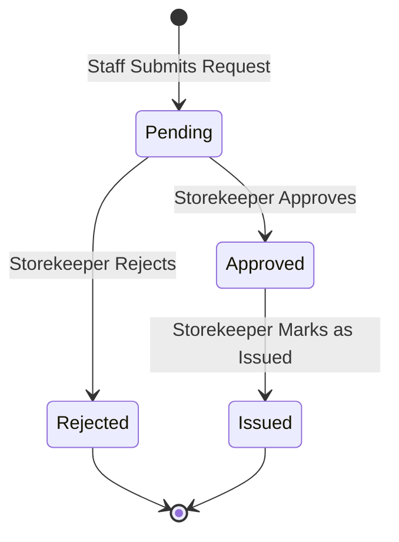

# Project Context: Inventory Request System

## 1. Selected Case Restatement
The **Inventory Request System** is an internal web-based prototype designed to streamline how staff members request inventory items and how storekeepers manage those requests.
- **Staff Members** can submit requests specifying the item, quantity, reason, and requested date, and monitor their progress.
- **Storekeepers** have administrative oversight to approve, reject, annotate, and mark requests as fulfilled (issued).
- **Access Control** ensures staff members cannot self-approve requests or alter storekeeper feedback notes.

---

## 2. Workshop Scope
The scope of this workshop is to build a fully functional, small-scale web prototype utilizing:
- **Frontend**: React (SPA with responsive styling, intuitive forms, and filtered lists).
- **Backend**: Node.js with Express providing a RESTful API.
- **Database**: Local MySQL to store and persist request and user records.

---

## 3. Roles and Responsibilities
The system enforces two distinct roles:

### A. Staff Member
- **Submit Requests**: Create new inventory requests specifying item name, quantity, reason, requested date, and requester name.
- **View Status**: View their submitted requests and check if they are `Pending`, `Approved`, `Rejected`, or `Issued`.
- **Restrictions**:
  - Cannot approve or issue their own requests (or any requests).
  - Cannot create or edit Storekeeper Notes.

### B. Storekeeper
- **Review Dashboard**: View all requests submitted across the organization.
- **Approve / Reject**: Transition request states with decision feedback.
- **Add Notes**: Attach comments/explanations to any request.
- **Issue Items**: Mark previously `Approved` requests as `Issued` once the physical item is handed over.
- **Restrictions**:
  - Cannot submit requests as a staff member (unless explicitly switching roles, but the roles remain separate).

---

## 4. Main Entity & Workflow
The primary domain model is the **Inventory Request**.

### Database Schema Draft (Inventory Request)
- `id` (INT, Primary Key, Auto-Increment)
- `item_name` (VARCHAR, Required)
- `quantity` (INT, Positive, Required)
- `reason` (TEXT, Required)
- `requested_date` (DATE, Required)
- `requester_name` (VARCHAR, Required)
- `status` (ENUM('Pending', 'Approved', 'Rejected', 'Issued'), Default 'Pending')
- `storekeeper_note` (TEXT, Nullable)
- `created_at` (TIMESTAMP, Default CURRENT_TIMESTAMP)

### State Workflow Diagram

---

## 5. Secondary Features
- **Request Filtering**: Users can filter requests dynamically by:
  - Item Name
  - Requester Name
  - Status (Pending, Approved, Rejected, Issued)

---

## 6. Out of Scope
- **Real Inventory Tracking**: Tracking actual quantities in stock, warehouse bin locations, or automatic inventory deduction.
- **Complex Authentication/SSO**: Multi-factor authentication, Active Directory integration, or password reset flows (a simple role-switcher UI is sufficient for prototyping).
- **Audit Logging**: Comprehensive version histories of edits or database transaction logs.
- **Notifications**: Email, SMS, or Slack alerts when request statuses update.

---

## 7. Assumptions
- A local MySQL instance is installed and running on the host system.
- Standard input validation is enough (e.g., quantity must be greater than 0, dates must be valid).
- A simple role-selection mechanism in the UI will allow simulating interactions as either a Staff member or a Storekeeper.

---

## 8. Missing Details & Clarifications Needed
- **Item Master Catalog**: Should staff type the item name freely (free-text), or choose from a predefined list of items? (Assumed free-text for the prototype).
- **Requester Identity**: Is there a pre-seeded user table, or is `requester_name` just entered manually as text on each request submission?

---

## 9. Likely Risks & Mitigation Strategies
- **Role Bypassing (Security Risk)**: Since this is a prototype, API endpoints might not be secured.
  - *Mitigation*: Ensure the backend validation checks the role before updating request statuses or notes.
- **Concurrency conflicts**: Multiple storekeepers reviewing/editing the same request simultaneously.
  - *Mitigation*: Simple state checks on the backend ensuring status transitions are valid (e.g., cannot issue a rejected request).
