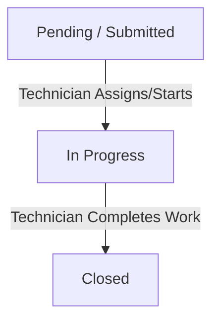

# Project Context: Maintenance Request Tracker

This document establishes the scope, architecture, roles, workflows, assumptions, and risks for the Maintenance Request Tracker prototype.

---

## 1. Case Summary
The **Maintenance Request Tracker** is a small-scale web prototype designed to streamline communication between two main roles: **Requesters** (people reporting maintenance problems) and **Technicians** (people resolving the problems). Requesters submit issues with relevant details and track their status, while Technicians review requests, document their notes, update status progress, and close requests upon completion.

---

## 2. Workshop Scope
The objective is to build a functional prototype of the tracker utilizing:
*   **Frontend**: React (SPA with basic view switching or role toggling to simulate different roles).
*   **Backend**: Node.js with Express.
*   **Database**: Local MySQL to persist maintenance requests.

The focus is on the core CRUD and status transition operations of the main entity: **Maintenance Request**.

---

## 3. Roles and Responsibilities

### Requester
*   **Submit Request**: Create a new maintenance request with:
    *   Title
    *   Description
    *   Location (e.g., Room, Floor, Building)
    *   Priority (e.g., Low, Medium, High)
    *   Requester's Name
*   **View Status**: Browse submitted requests and see their current workflow status.
*   **Restrictions**: Cannot update technician notes, progress, or close requests.

### Technician
*   **View Submitted Requests**: Browse and read all requests.
*   **Add/Update Technician Notes**: Document internal notes about the diagnostic work or updates.
*   **Update Progress**: Change the status of the request as it undergoes work.
*   **Close Request**: Mark requests as "Closed" once the physical maintenance work is completed.
*   **Restrictions**: Normal users/requesters cannot access these administrative functions.

---

## 4. Main Entity & Workflow

### Main Entity: Maintenance Request
A request has the following attributes:
*   `id` (Primary Key, Auto-increment)
*   `title` (String, required)
*   `description` (Text, required)
*   `location` (String, required)
*   `priority` (Enum/String: 'Low', 'Medium', 'High')
*   `requester_name` (String, required)
*   `status` (Enum/String: 'Pending', 'In Progress', 'Completed' / 'Closed')
*   `technician_notes` (Text, optional)
*   `created_at` (Timestamp, auto-set)
*   `updated_at` (Timestamp, auto-update)

### Main Workflow (Lifecycle)

---

## 5. Secondary Features
*   **Filtering**: Users (both Requesters and Technicians) can filter the lists of requests by:
    *   Location
    *   Priority
    *   Status

---

## 6. Out of Scope
*   **Authentication & Authorization System**: No full registration, login passwords, or JWT-based role validation. Instead, simple simulated role toggling or username-based routing.
*   **Notification System**: Real-time alerts, SMS, or email notifications when status changes.
*   **Media Attachments**: Ability to upload photos or videos of the maintenance issue.
*   **Audit Trail/History**: A detailed historical log of every single state transition or note edit (beyond updating the last modified timestamp).
*   **Asset Management**: Registering specific equipment or physical inventory.

---

## 7. Assumptions
*   **Role Identification**: The frontend will use a simple role switcher (e.g., a header dropdown selecting "View as Requester" or "View as Technician") to demonstrate the distinct features of the prototype.
*   **Locations**: Pre-defined set of locations or a simple text input box is acceptable for the prototype. We will use a dropdown of standard locations (e.g., Lobby, Building A, Building B, Room 101) to make filtering cleaner.
*   **Data Integrity**: Requesters are not authenticated, so anyone viewing the requester page sees all requests and their status.

---

## 8. Missing Details
*   **Closed Status naming**: Whether we use `Completed`, `Closed`, or both as the final state. (We assume the final status is `Closed` for clarity).
*   **Pre-defined fields**: Whether location options should be hardcoded in the frontend/backend or dynamically fetched from a database table. (We assume a hardcoded set of common options is sufficient for this prototype).

---

## 9. Likely Risks
*   **Concurrency Conflicts**: Multiple technicians attempting to update the same request simultaneously, resulting in overwritten notes or incorrect status transitions.
*   **Input Validation & SQL Injection**: Malicious input in free-text fields (`title`, `description`, `technician_notes`) disrupting SQL queries if parameterized queries are not used.
*   **Access Control Bypass**: Requesters manually hitting backend endpoints (e.g., using tool like Postman) to update notes or close requests, bypassing frontend restrictions. We must implement basic route/controller-level checking of roles (e.g., passing a header representing the role).
