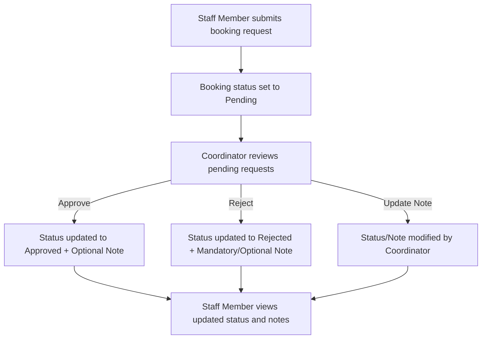

# Project Context: Room Booking System

## Selected Case: Room Booking System
The manual booking of shared rooms has led to scheduling conflicts, lack of tracking, and administrative inefficiency. This project aims to build a simple, reliable Room Booking System that digitalizes the workflow. It allows staff members to request room bookings and track their status, while enabling coordinators to oversee, approve, reject, or update all booking requests with status notes.

---

## Workshop Scope
This is a focused, lightweight application utilizing the following stack:
*   **Frontend**: React (Single Page Application)
*   **Backend**: Node.js with Express.js
*   **Database**: Local MySQL
*   **Workflow Focus**: Purely restricted to the room booking lifecycle and filtering capabilities.

---

## Roles and Responsibilities
1.  **Staff Member**
    *   Submit new booking requests by providing: Room Name, Date, Start Time, End Time, Purpose, and Staff Name.
    *   View status (Pending, Approved, Rejected) and coordinator notes of their own booking requests.
    *   *Restriction*: Cannot approve/reject bookings, nor edit or view other users' bookings (unless explicitly allowed).
2.  **Coordinator**
    *   View a comprehensive dashboard containing all booking requests.
    *   Approve, reject, or update the status of any booking request.
    *   Attach explanatory notes to status updates (e.g., explaining why a booking was rejected).
    *   Filter and search bookings easily.

---

## Main Entity and Workflow
### Main Entity: Room Booking (`room_bookings`)
*   `id`: Unique identifier (Primary Key, Auto-increment)
*   `room_name`: Name of the room requested
*   `booking_date`: Date of the booking
*   `start_time`: Start time of the booking
*   `end_time`: End time of the booking
*   `purpose`: Purpose of the booking request
*   `staff_name`: Name of the staff member requesting the booking
*   `status`: Status of the booking (`Pending`, `Approved`, `Rejected`)
*   `coordinator_note`: Optional explanation or feedback provided by the coordinator
*   `created_at` / `updated_at`: Timestamps for auditing

### Main Workflow

---

## Secondary Features
*   **Filtering and Searching**: Ability to filter the list of bookings by:
    *   Room Name
    *   Date
    *   Booking Status (`Pending`, `Approved`, `Rejected`)

---

## Out of Scope
*   Production-ready Authentication & Authorization (e.g., OAuth, JWT login, registration, password hashing). A mock login/role switcher will be used instead.
*   Predefined room management system (adding, deleting, or editing physical room properties like capacity, projector availability, etc.).
*   Calendar integrations (e.g., Google Calendar, Outlook) and external notifications (Email, Slack).
*   Recurring bookings (e.g., every Wednesday).

---

## Assumptions and Missing Details
### Assumptions
1.  **Role Simulation**: Since full auth is out of scope, the application will provide a header/toggle to switch between acting as a **Staff Member** (with a configurable name) and a **Coordinator** to demo the features easily.
2.  **Room Input**: Rooms will be input via a dropdown list of pre-configured rooms (to prevent spelling variations like "Conf Room A" vs "Conference Room A") but stored as strings.
3.  **Conflict Resolution**: The system should alert the coordinator or automatically reject/prevent approval of overlapping time slots for the same room on the same day.

### Missing Details
*   *Validation Rules*: Should the backend block overlapping requests at the submission stage, or allow overlapping requests to be submitted and rely on the Coordinator to resolve the conflict upon approval? (Assuming: allow submission of overlapping requests, but block approval if another conflicting request is already approved for that slot).

---

## Likely Risks
*   **Double Bookings / Race Conditions**: Two coordinators approving conflicting pending bookings for the same room concurrently.
*   **Timezone & Format Discrepancies**: Parsing and storing dates/times between React (frontend) and MySQL (backend) incorrectly.
*   **Security Bypasses**: Ensuring the Express backend validates user roles on status updates rather than relying solely on frontend hides/shows.
