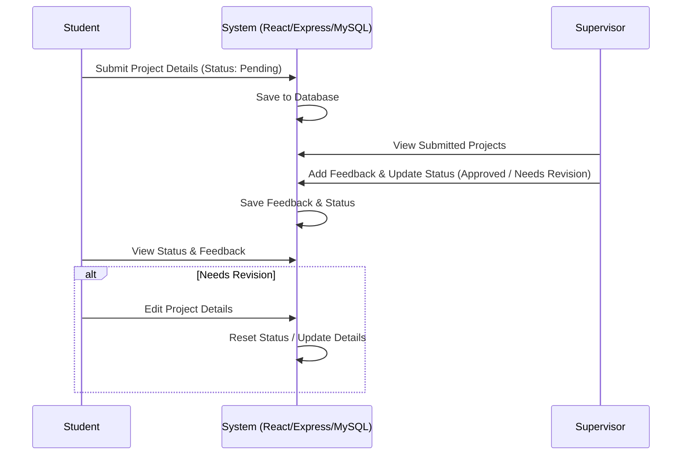

# Student Project Tracker - Project Context

## Project Overview
The Student Project Tracker is a prototype web application designed to streamline the software project submission and review workflow. Currently, students and supervisors rely on scattered documents and email/chat messages to track projects. This system consolidates submissions into a single platform, enabling students to submit and update their project details and supervisors to review submissions, offer feedback, and update project statuses.

---

## Role Definitions & Responsibilities

### 1. Student
- **Create Submissions**: Register a new project submission by inputting details (Title, Description, Category, Student Name, Supervisor Name, and Submitted Date).
- **Edit Submissions**: Update project details for their own submissions.
- **Restrictions**: Students cannot modify supervisor feedback or approve/change the status of their own projects.

### 2. Supervisor
- **Review Submissions**: View a dashboard list of all submitted projects.
- **Add Feedback**: Append reviews, guidance, and comments to project submissions.
- **Update Status**: Review project submissions and change their statuses (e.g., Pending, Approved, Needs Revision).

---

## Core Entities & Workflows

### Main Entity: Project Submission
Fields associated with a project submission:
- `id` (Primary Key)
- `title` (String)
- `description` (Text)
- `category` (String / Enum)
- `student_name` (String)
- `supervisor_name` (String)
- `submitted_date` (Date/DateTime)
- `status` (Enum: e.g., Pending, Approved, Needs Revision)
- `feedback` (Text, optional, supervisor-only writable)

### Main Workflow

---

## Secondary Features
- **Filtering Capabilities**: Ability to filter the list of projects by:
  - Supervisor name
  - Category
  - Project status

---

## Scope Boundaries

### In Scope
- Single-page dashboard or simple page layouts for Students and Supervisors.
- React frontend, Node.js + Express backend, and MySQL database connection.
- Submission creation and updating for students.
- Feedback and status updates for supervisors.
- Read-only restrictions for students on supervisor-controlled fields.
- Filtering projects by supervisor, category, and status.

### Out of Scope
- **Advanced Authentication & Authorization**: A simple selector to switch between "Student" and "Supervisor" profiles is sufficient for this prototype rather than full OAuth, JWT, or multi-tenant user account registration.
- **File Uploads**: Students submitting links or plain text descriptions instead of uploading document files (PDFs, ZIPs).
- **Email Notifications**: Automatic email triggers when statuses are changed.
- **Audit Logs / History**: Version tracking for edited project descriptions.

---

## Assumptions & Missing Details

### Assumptions
1. **User Identity Simplicity**: For the prototype, the user role (Student/Supervisor) can be simulated via a header toggle or simple session selector to focus on the submission and status workflow.
2. **Preset Categories/Supervisors**: Categories (e.g., Web App, Mobile App, AI/ML, IoT) and Supervisors can be pre-populated or dynamically generated from the existing submissions.
3. **Database Setup**: A local instance of MySQL is available and will store a single `projects` table (plus helper tables if needed, though a single-table schema is likely sufficient for this prototype).

### Missing Details (To Be Resolved in Implementation)
- **Status Options**: Exactly what status values are desired (e.g., "Pending", "Approved", "Changes Requested", "Rejected").
- **Unique Identification**: How we match a student to their specific projects if there's no full login (e.g., filter by student name).

---

## Likely Risks & Mitigations

| Risk | Impact | Mitigation |
| :--- | :--- | :--- |
| **Student tampering with status/feedback** | High | Enforce API-level validation so backend updates check the role context; do not rely solely on front-end UI hiding. |
| **SQL Injection & Data Validation** | Medium | Use parameterized queries (prepared statements) in Express and validate input payloads using libraries or basic validation helpers. |
| **Environment configuration issues** | Low | Document database schema creation script (`schema.sql`) and provide clear `.env` templates. |
